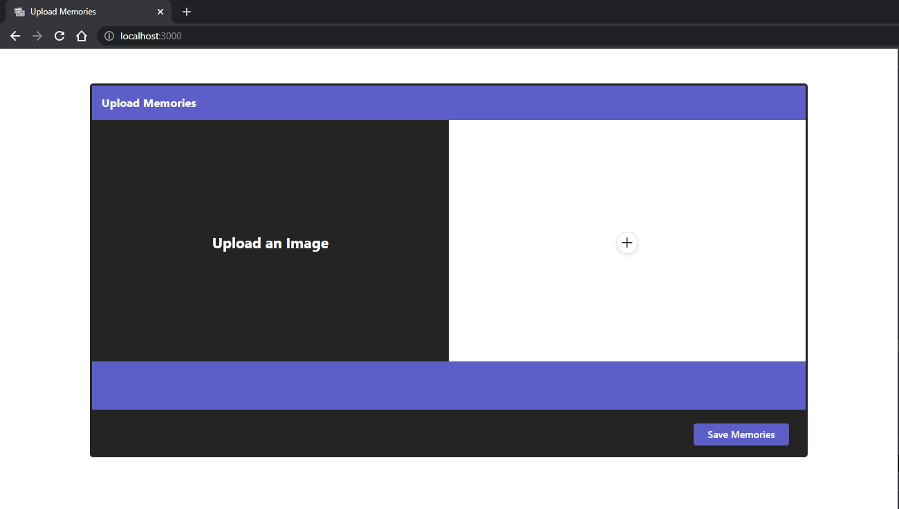
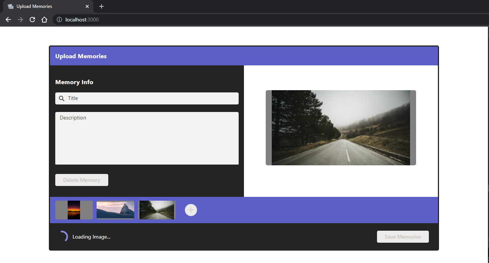
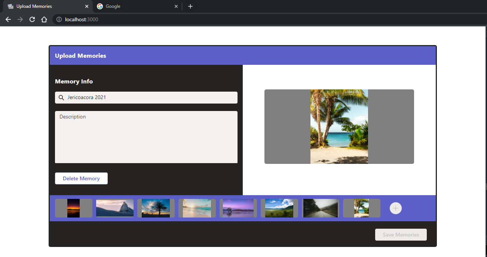

	

<h1 align="center">Upload Memories</h1>

## Status

<h4 align="center"> 
	Upload Memories - Finished! ✅
</h4>

## Description

Uplaod Memories is a feature that allows the user to organize a series of images with titles and descriptions. It's a way to manipulate an array of objects that can be used as a carousel, for example. 

## Content

- [Description](#description)
- [Status](#status)
- [Content](#content)
- [How to use it?](#how-to-use-it)
- [Stack and Technoloy](#stack-and-technology)
- [ApplicationPhotos](#application-photos)

## How to use it?

Uplaod Image is an frontend feature.

1. Clone the repository
2. "npm install" in the main folder
3. "npm start" in the same folder

## Stack and Technology

- React JS
- Fluent UI - react-northstar (Microsoft)

## Application Photos

